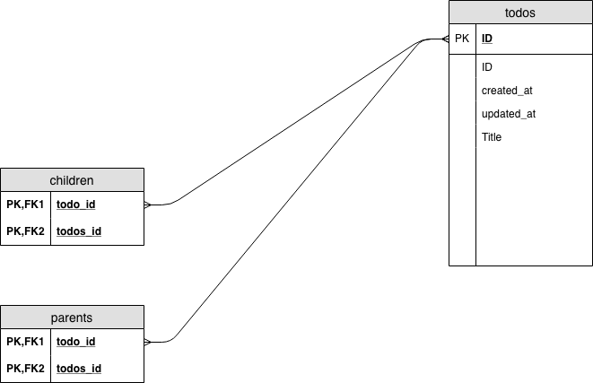
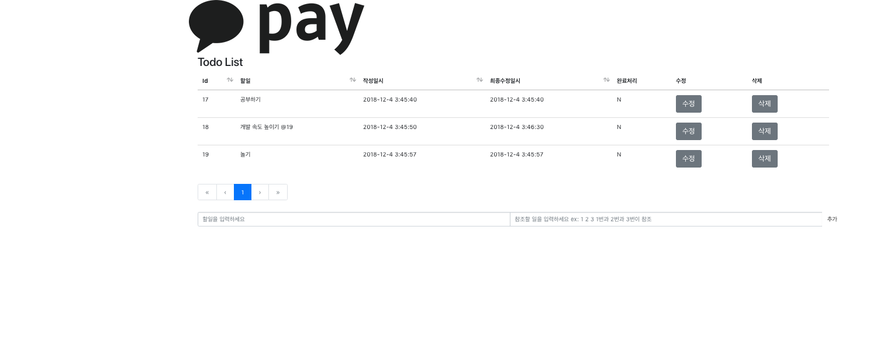
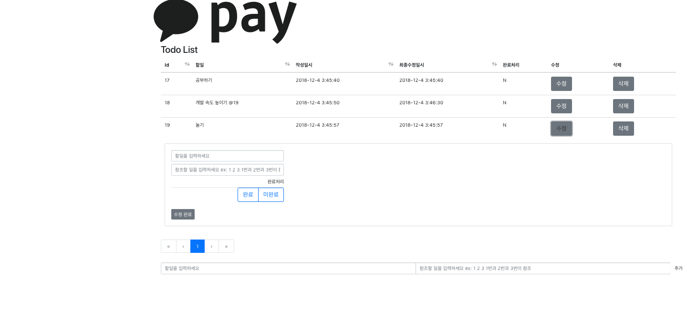

프로젝트 빌드 및 실행 방법
===

<pre><code>
Go get github.com/heejoonshin/wastest
cd $GOPATH/github.com/heejoonshin/wastest
이동후

go build
./wastest

또는 

go run server.go

</code></pre>
위의 명령어를 통하여 API서버를 가동 시킵니다.
포트는 8080으로 고정 되어 있습니다.

<pre><code>
cd $GOPATH/github.com/heejoonshin/wastest/view
npm install
npm start

</code></pre>
위 명령어로 프론트엔드를 가동 시킵니다. 포틑 8081을 사용하지 않는 다면 8081을 사용합니다.

유닛 테스트 방법

<pre><code>
cd $GOPATH/github.com/heejoonshin/wastest/Todolist/test
go test

</code></pre>

개발환경
---

Golang V1.11.2

npm V6.4.1

node V11.0.0

OS mac

사용라이브러리 
---

golang gin framework

golang gorm

Vue.js

Vue bootstrap

axios.js

API Spac
---
method | rount| inputType| retrunType |
--- | --- | --- | --- |
GET | /todo | x | Json {Id: 일 아이디, Title:일 제목 , Children:[참조건 리스트]}|
POST| /todo/ |Json {Title:일 제목 , Children:[참조건 리스트]} | Json {Id: 일 아이디, Title:일 제목 , Children:[참조건 리스트]}|
PUT|/todo/:id | Json{Title:일 제목 (비워있을경우 기존 데이터) , Children:[바뀔 참조 리스트 ,-1입력시 전체 삭제],Done:완료여부(N/Y)|{Id: 일 아이디, Title:일 제목 , Children:[참조건 리스트]}|
DELETE|/todo/:id |Json{Id :삭제할 아이디}|Json {Id: 일 아이디, Title:일 제목 , Children:[참조건 리스트]}|
GET|/todolist?| Querystring{limit:리턴받을 리스트 수 (기본 10개),page: 조회할 페이지(기본 1), order:recent(최신순) or done(완료순) or id(기본값 id)|Json {[{Id: 일 아이디, Title:일 제목 @참조ID,CreatedAt:작성날짜,UpdatedAt:수정 날, Children:[참조건 리스트]}],Totaldata:총데이터 개수,Limit : 리스트에 나올 개수 , page:현재 페이지}

 문제 해결 전략
 ---

*핵심 아이디어

Todos 테이블은 자식 정보를 담고 있는 테이블과 부모 정보를 가지고 있는 테이블을 가지고 있습니다.
이 테이블록 해당 자식 (참조가 걸린 정보)와 부모 (참조가 된 정보)를 알 수 있습니다.

할일 추가시 다른 할일을 참조 하는 관계를 그래프문제로 생각하고 참조된 관계를 단방향 그래프 U -> V라고 생각 했습니다.
만약 1번 할일이 2번을 참조 했다면 1 -> 2 로 표현 할 수 있습니다.

1 의 자식은 2 이고, 2의 부모는 1 입니다.

다음은 그래프의 성질을 이용하여 예외 조건을 생각했습니다.
위 문제는 위상 정렬 문제로서 이 그래프의 특징은 DAG(Directed acyclic graph)입니다.
즉 사이클이 존재 하지 않는 조건을 만족 시키면서 데이터 베이스에 해당 정보를 저장 시켜야 합니다.

사이클이 존재 하지 않는 조건을 만족 시키기 위해 Children테이블을 재귀적으로 탐색 하면서 자손리스트를 구하였습니다.
즉 참조의 참조를 하는 상황을 차단 시켰습니다.

해당 작업의 완료 처리 여부를 미완료에서 완료로 바꾼때 1 Depth의 작업의 모두 완료 상태를 만족해야 바꿀 수 있게 하였습니다.

해당 작업의 완료 처리 여부를 완료에서 미완료로 바꿀때 현재 작업 보다 먼저 끝내지 못하는 작업이 존재하는지 확인 하였습니다.
확인 하는 방법은 역참조 그래프를 이용해 구했습니다.

세부 기능 설명

1. 할일 추가

할일 추가시 다른 일을 참조할 때 참조된 일이 완료된 상태에 있으면 안되게 만들었습니다.
id는 부호없는 64비트 정수형으로 지정했습니다.

2. 할일 수정

수정 시 참조가 사이클이 생길 수 있어 이를 막는 로직 구현
완료로 수정시 위의 설명처럼 안되는 경우 체크

3. 할일 목록 조회

기본 10개의 정보가 한 화면에 보여지며 입력받은 페이지정보를 바탕으로 리스트를 리턴해 준다.

UI 사용방법
---

프론트를 실행 시키면 다음과 같은 화면이 나오고
제일 밑에 하단에서 할일과 참조할 일을 입력합니다 참조할 일은 스페이스로 구분합니다.

수정 버튼을 누르면 수정하는 페이지가 나오고, 할일 또는 참조할 일 또는 완료처리를 수정 할 수 있습니다.
 

